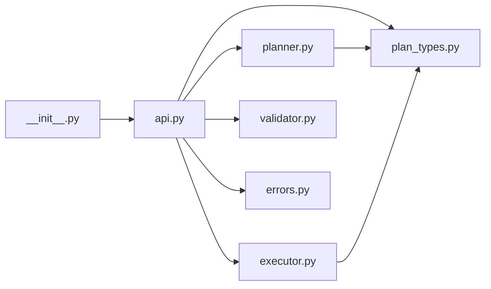

# omni_api

[](https://github.com/binzhango/omni_api/actions/workflows/ci-publish.yml)
[](https://pypi.org/project/omni-api/)
[](https://pypi.org/project/omni-api/)

`omni_api` is a payload adaptation layer for platform teams that need to enforce backend API contracts while supporting heterogeneous upstream producers.
Requires Python 3.11+.

## Install

```bash
pip install omni-api
```

Optional with uv:

```bash
uv add omni-api
```

## Quickstart

```python
from omni_api import transform

source_payload = {
    "full_name": "John Doe",
    "age": 30,
    "contact": {"email": "john@example.com"},
    "extra_data": "ignored",
}

target_schema = {
    "type": "object",
    "properties": {
        "name": {"type": "string"},
        "age": {"type": "number"},
        "email": {"type": "string"},
    },
    "required": ["name", "age", "email"],
}

result = transform(source_payload, target_schema)
print(result.payload)
# {'name': 'John Doe', 'age': 30, 'email': 'john@example.com'}
```

## API

### `transform(source_payload, target_schema)`

Inputs:
- `source_payload`: `dict[str, Any]`
- `target_schema`: JSON Schema object subset (`type`, `properties`, `required`)

Returns `TransformResult`:
- `payload`: transformed payload restricted to target schema keys
- `plan`: deterministic transform plan with mapping decisions
- `report`: mapped/dropped/missing fields and warnings

Raises:
- `TransformSchemaError`: unsupported schema shape
- `TransformValidationError`: missing required or invalid output payload

## Core Architecture Model

`omni_api` follows a deterministic two-step model:
1. Compile a Transform Plan from source payload plus target contract.
2. Execute that plan with a pure transformation step.

Core components:
- Router: selects target backend profile/route (future extension)
- Schema Loader: loads canonical backend contract
- Planner: generates deterministic mappings
- Executor: applies `mappings`, `defaults`, and `drops`
- Validator: enforces required fields and output constraints
- Diagnostics: emits structured transformation report

## Module Relationship Graph



## Contracts and Canonical Artifacts

- Backend contracts should be maintained as JSON Schema under `schemas/<provider>/<endpoint>.json`.
- Transform Plan DSL includes `mappings`, `defaults`, `drops`, `required`.
- Output keys are constrained to schema-defined keys in strict mode.

## Development

Run tests with `uv`:

```bash
cd python
uv run pytest -q
```

Run live Ollama integration test (requires local Ollama server/model):

```bash
cd python
OLLAMA_MODEL=llama3.1:latest uv run python scripts/run_ollama_integration.py
RUN_OLLAMA_INTEGRATION=1 OLLAMA_MODEL=llama3.1:latest uv run pytest tests/test_ollama_integration.py -s -vv
```

Build package artifacts:

```bash
cd python
uv run --with build python -m build
```

## Release

Publishing is automated via GitHub Actions (`.github/workflows/ci-publish.yml`):
- Push to `main` runs tests and then attempts PyPI publish
- Publish uses GitHub secret `PYPI_API_TOKEN`
- Bump `python/pyproject.toml` version before merge to `main` to avoid duplicate version failures
